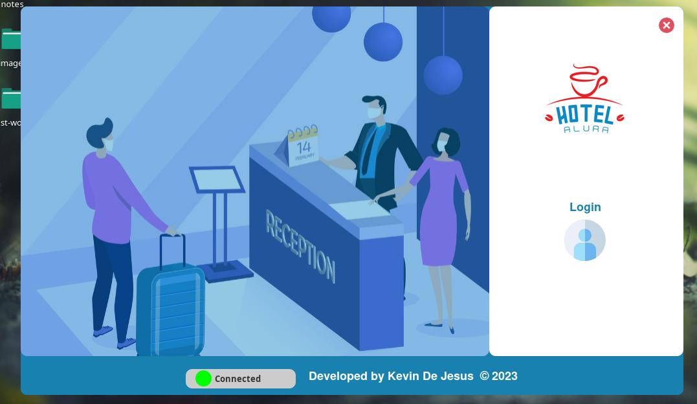

# Alura Hotel

Hello this is a project practice, by alura latam,
very important, enviroment variables required to run :

---

- MYSQL_ROOT_PASSWORD / necessary to success connect
- MYSQL_USER / default root in mysql
- URL/ example = jdbc:mysql://localhost:3306/hotelalura
- SECRET / for password encript
- PRICE_PER_NIGHT / calculated price booking

>> java source = 17
>>

